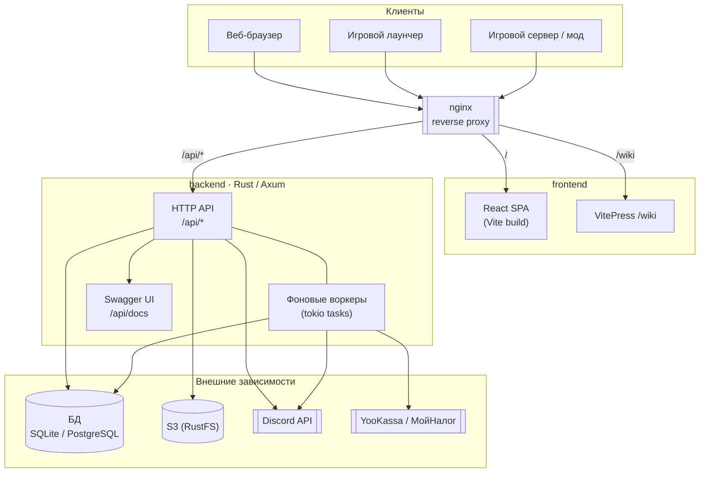
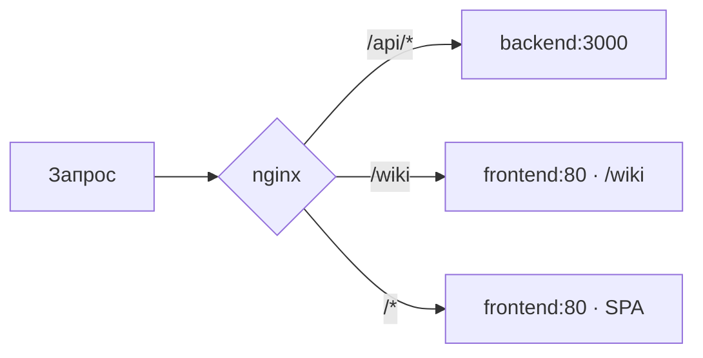
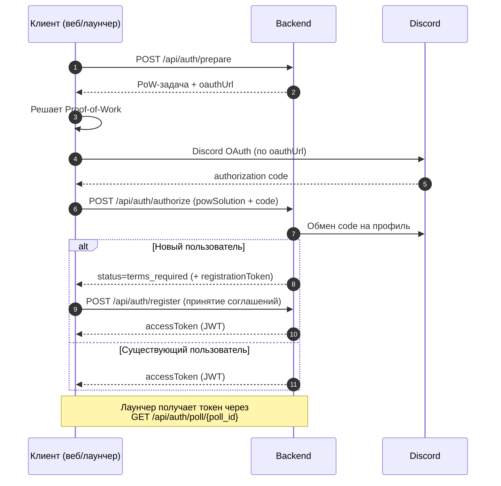
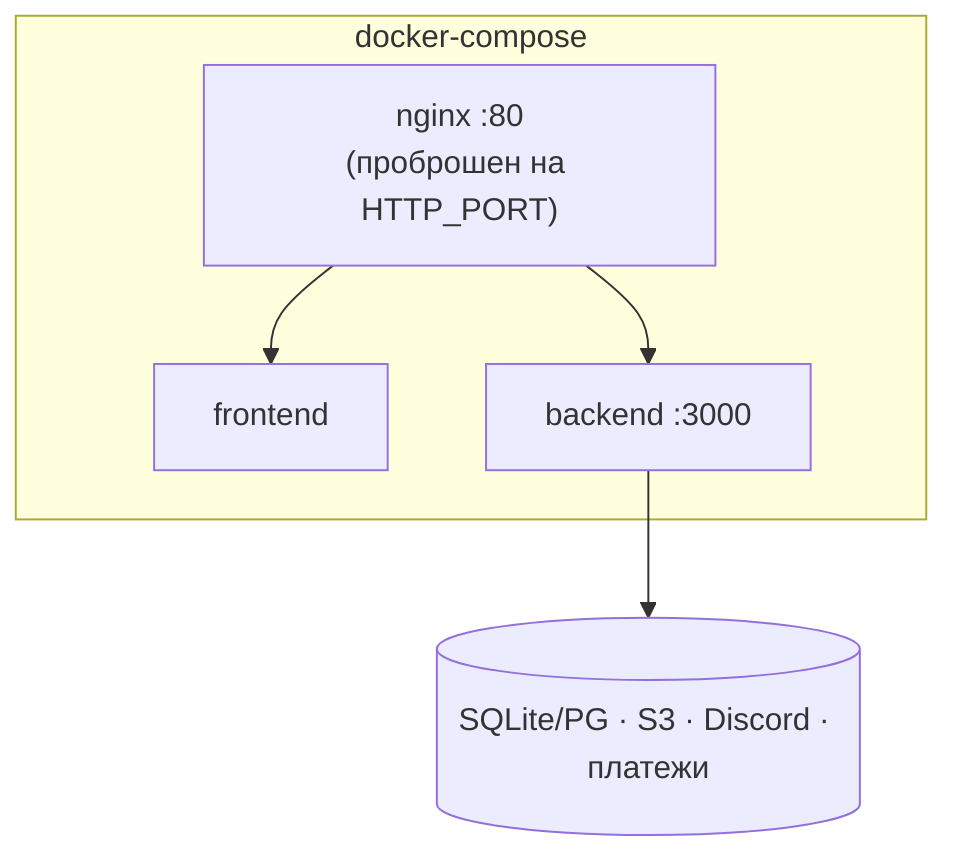

# SvoGame — учётные записи и игровые системы

Монорепозиторий платформы игрового аккаунта проекта **SvoCraft**: единая точка входа для авторизации игроков, их профилей, экономики, скинов, магазина, лутбоксов, античит-проверок и игровой статистики.

Бэкенд написан на **Rust (Axum + SeaORM)**, фронтенд — на **React (Vite)**, всё собирается и разворачивается через **Docker Compose** за реверс-прокси **nginx**.

---

## Что это за проект

Бэкенд объединяет несколько пересекающихся доменов вокруг одной сущности `User`:

| Слой | Домены | Назначение |
|------|--------|-----------|
| **Identity** | `auth`, `users`, `compat` | Вход через Discord OAuth2 + Proof-of-Work, выпуск JWT, совместимость со сторонними лаунчерами |
| **Social** | `squads`, `restrictions` | Сквады, инвайты, ограничения действий пользователя |
| **Economy** | `ownership`, `shop`, `lootboxes`, `referrals` | Каталог ассетов, инвентарь, кошелёк и валюты, магазин, лутбоксы, реферальные кампании |
| **Media / Game** | `skins`, `gunskins`, `metrics`, `littlemice` | Загрузка и валидация скинов, скины оружия, приём и агрегация игровой статистики, античит-проверки |
| **Ops** | `admin`, `discord`, `meta`, `system` | Админ-панель, доставка сообщений в Discord, мета-конфиги, health-check |

Ключевые особенности:

- **Discord-only авторизация** с защитой от абьюза через Proof-of-Work.
- **Доставка токена в лаунчер** через polling (`/api/auth/poll/{id}`) — вход в аккаунт можно инициировать из веба, а токен получить в игровом клиенте.
- **Приём игровых метрик** потоковым парсером NDJSON без хранения сырых логов, с публикацией результатов матчей в Discord и лидербордом.
- **Магазин с реальными платежами** (YooKassa) и фискализацией чеков (МойНалог), либо mock-провайдер для разработки.
- **Хранение медиа в S3** (скины, скриншоты проверок).
- **Автодокументация API** через OpenAPI/Swagger на `/api/docs`.

---

## Архитектура



### Маршрутизация запросов

nginx — единственный публичный порт. Он раздаёт статику фронтенда, документацию и проксирует всё, что начинается с `/api/`, на бэкенд.



### Технологический стек

| Компонент | Технологии |
|-----------|-----------|
| **Backend** | Rust 2024, Axum 0.8, Tokio, SeaORM 1.1 (SQLite/Postgres), aws-sdk-s3, JWT (`jwt`/`hmac`), utoipa (OpenAPI), reqwest, image |
| **Frontend** | React 19, Vite 7, TypeScript, Zustand, TailwindCSS 4, skinview3d + three.js (3D-превью скинов), react-hot-toast |
| **Docs (wiki)** | VitePress |
| **Инфраструктура** | Docker, Docker Compose, nginx, GitHub Actions (публикация образов в GHCR) |

---

## Требования к окружению

Для запуска понадобятся:

- **Rust** 1.90+ (edition 2024) — для локального бэкенда.
- **Node.js** 22+ — для фронтенда и документации.
- **S3-совместимое хранилище** — Тестировалось и работало с RustFS в качестве провайдера S3. Бакет создаётся автоматически при старте, если его нет.
- **База данных** — SQLite «из коробки» (файл `db.sqlite`) или PostgreSQL для продакшена. Миграции выполняются автоматически при старте бэкенда.
- **Discord OAuth-приложение** — `client_id`, `client_secret`, redirect URI. Обязательно для входа.
- **JWT-секрет** — произвольная длинная строка для подписи токенов.
- *(опционально)* Discord-бот, YooKassa, МойНалог, почтовый провайдер — активируются переменными окружения.

> ⚠️ Discord API недоступен из РФ. Для боевого окружения задайте `DISCORD_PROXY` или разворачивайте сервис вне России.

---

## Быстрый старт (локальная разработка)

### 1. Установка зависимостей

```bash
npm install          # ставит зависимости фронтенда (npm workspaces)
```

Бэкенд-зависимости Cargo подтянутся при первом `cargo run`.

### 2. Настройка окружения

```bash
cp .env.example .env
# отредактируйте .env: DISCORD_*, JWT_SECRET, S3_*, DATABASE_URL
```

Минимально необходимые переменные для старта: `DISCORD_CLIENT_ID`, `DISCORD_CLIENT_SECRET`, `DISCORD_REDIRECT_URI`, `JWT_SECRET`, `S3_*`, `DATABASE_URL`, `LITTLEMICE_PUBLIC_BASE_URL`.

Для S3 локально рекомендуется поднять [RustFS](https://rustfs.com) — S3-совместимое хранилище на Rust, на котором проект тестировался:

```bash
docker run -d --name rustfs \
  -p 9000:9000 -p 9001:9001 \
  -v rustfs-data:/data \
  -e RUSTFS_ACCESS_KEY=your_s3_access_key \
  -e RUSTFS_SECRET_KEY=your_s3_secret_key \
  -e RUSTFS_ADDRESS=":9000" \
  -e RUSTFS_CONSOLE_ADDRESS=":9001" \
  -e RUSTFS_CONSOLE_ENABLE=true \
  rustfs/rustfs:latest /data
```

S3 API будет доступен на http://127.0.0.1:9000, веб-консоль — на http://127.0.0.1:9001. Значения `RUSTFS_ACCESS_KEY` / `RUSTFS_SECRET_KEY` должны совпадать с `S3_ACCESS_KEY_ID` / `S3_SECRET_ACCESS_KEY` в `.env`, а `S3_ENDPOINT=http://127.0.0.1:9000` с `S3_FORCE_PATH_STYLE=true`. Бакет из `S3_BUCKET` бэкенд создаст сам при старте.

### 3. Запуск

```bash
npm run dev
```

Эта команда параллельно поднимает бэкенд (`cargo run -p auth`) и, дождавшись его готовности, фронтенд (Vite). По умолчанию:

- Backend API — http://127.0.0.1:3001
- Frontend (dev) — http://localhost:5173 (проксирует `/api` на бэкенд)
- Swagger UI — http://127.0.0.1:3001/api/docs

Отдельные команды при необходимости:

```bash
npm run backend:dev     # только бэкенд
npm run frontend:dev    # только фронтенд
npm run docs:dev        # только VitePress-документация
cargo test -p auth      # тесты бэкенда
```

---

## Поток авторизации

Вход построен вокруг Discord OAuth2 c защитой Proof-of-Work и опциональной доставкой токена в лаунчер через polling.



JWT содержит `auth_epoch` пользователя — смена epoch (например, при бане) инвалидирует все ранее выпущенные токены.

---

## Фоновые воркеры

Бэкенд при старте поднимает набор tokio-задач, работающих по интервалам:

| Воркер | Назначение |
|--------|-----------|
| `auth_cleanup` | Очистка просроченных auth-сессий/кэша |
| `shop_reconciliation` | Сверка статусов платежей с провайдером |
| `receipt` | Фискализация чеков (МойНалог) с ретраями |
| `email_delivery` | Отправка писем через outbox |
| `discord_delivery` | Доставка уведомлений в Discord |
| `metrics_discord_delivery` | Публикация результатов матчей в Discord |
| `littlemice_expiry` / `littlemice_cleanup` | Истечение и удаление старых античит-проверок и их артефактов в S3 |

Модель доставки везде — **outbox с ретраями**: событие сохраняется в БД и отправляется воркером, что переживает перезапуски и недоступность внешних сервисов.

---

## Игровые метрики

Приём статистики матчей встроен в бэкенд как потоковый pipeline (без отдельного сервиса):

1. Axum принимает `application/x-ndjson` (или `multipart/form-data`).
2. Поток читается чанками: одновременно считается SHA-256 и разбираются завершённые строки — весь файл в память не грузится.
3. Агрегатор считает команды, damage, presence-интервалы и per-player статистику.
4. После строгой валидации одной транзакцией сохраняются ingestion, матч, игроки, история никнеймов, участие и Discord-outbox.
5. Read API (`/api/metrics/...`) отдаёт только завершённые матчи и лидерборд.

Сырой NDJSON не хранится — только SHA-256, счётчики и нормализованные агрегаты. Повторная загрузка того же `game_id` отклоняется. Подробности — в [`docs/metrics.md`](docs/metrics.md).

---

## Развёртывание (production)

Развёртывание — через Docker Compose. Три сервиса: `backend`, `frontend`, `nginx`.



### Ручной запуск

```bash
cp .env.example .env      # заполните боевыми значениями
docker compose up -d --build
```

nginx слушает на `127.0.0.1:${HTTP_PORT:-3017}` (предполагается внешний TLS-терминатор). Контейнеры подключаются к внешней сети `svo-server-${BRANCH:-local}` — создайте её заранее:

```bash
docker network create svo-server-local
```

### Автоматический деплой

Скрипты `deploy.sh` (ветка `production`) и `deploy-stage.sh` (ветка `stage`) под flock-локом делают hard reset на удалённую ветку и пересобирают Compose:

```bash
./deploy.sh          # production
./deploy-stage.sh    # stage
```

Образы также публикуются в GitHub Container Registry через workflow [`.github/workflows/containers-ghcr.yml`](.github/workflows/containers-ghcr.yml).

---

## Конфигурация

Все параметры задаются через переменные окружения (см. полный список в [`.env.example`](.env.example)). Основные группы:

| Группа | Ключевые переменные |
|--------|---------------------|
| **Сеть** | `BINDING_ADDRESS`, `HTTP_PORT`, `BRANCH` |
| **Discord** | `DISCORD_CLIENT_ID`, `DISCORD_CLIENT_SECRET`, `DISCORD_REDIRECT_URI`, `DISCORD_BOT_TOKEN`, `DISCORD_PROXY` |
| **БД / хранилище** | `DATABASE_URL`, `S3_ENDPOINT`, `S3_BUCKET`, `S3_ACCESS_KEY_ID`, `S3_SECRET_ACCESS_KEY`, `S3_FORCE_PATH_STYLE` |
| **Безопасность** | `JWT_SECRET`, `POW_COMPLEXITY` |
| **Магазин** | `SHOP_PAYMENT_PROVIDER` (`mock`/`yookassa`/`disabled`), `YOOKASSA_*`, `SHOP_RECEIPTS_ENABLED`, `MYTAX_*` |
| **Метрики** | `METRICS_INGEST_SECRET`, `METRICS_DISCORD_CHANNEL_ID`, `METRICS_PUBLIC_BASE_URL` |
| **Почта** | `EMAIL_DELIVERY_ENABLED`, `XYECOC_*` |
| **Аналитика (frontend)** | `VITE_UMAMI_*` |

Многие интеграции по умолчанию выключены и активируются только при заполнении соответствующих переменных (магазин → `disabled` в release, почта/чеки → `false`, метрики → `503` без секрета).

---

## Структура репозитория

```
.
├── backend/                 # Rust-крейт `auth` (Axum + SeaORM)
│   ├── src/
│   │   ├── app/             # bootstrap, router, config, state, http, docs
│   │   ├── domains/         # HTTP-домены: auth, users, shop, metrics, ...
│   │   ├── entities/        # SeaORM-модели (41 сущность)
│   │   ├── services/        # бизнес-логика, воркеры, интеграции, миграции
│   │   └── util/
│   └── tests/               # интеграционные тесты
├── frontend/                # React SPA (Vite) + VitePress docs (/wiki)
│   └── src/                 # api/, pages/, components/, store/, routes/
├── docs/                    # проектная документация (домены, метрики, дизайн)
├── docker-compose.yml       # backend + frontend + nginx
├── nginx.conf               # reverse proxy + security headers/CSP
├── deploy.sh / deploy-stage.sh
└── .env.example             # эталон конфигурации
```

---

## Документация

- [`docs/abstract.md`](docs/abstract.md) — абстрактная доменная модель системы.
- [`docs/metrics.md`](docs/metrics.md) — архитектура приёма игровых метрик.
- [`docs/ownership-design.md`](docs/ownership-design.md), [`docs/lootboxes-design.md`](docs/lootboxes-design.md), [`docs/referrals-frontend-tz.md`](docs/referrals-frontend-tz.md) — дизайн экономических доменов.
- **Swagger UI** — интерактивная спецификация API на `/api/docs` (OpenAPI: `/api/openapi.json`).
